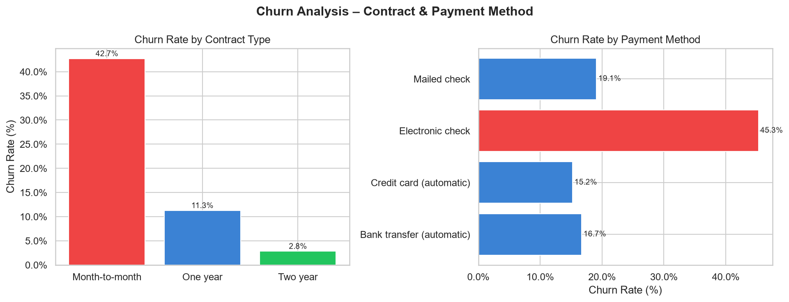
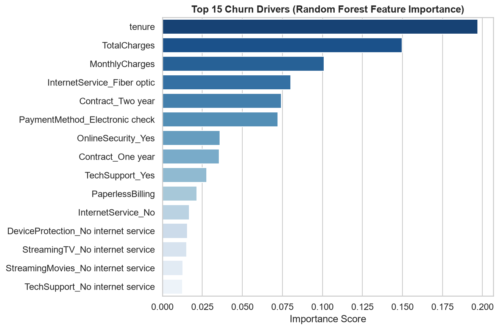

# Telco Customer Churn — Business Analytics Capstone

> **End-to-end churn prediction and retention strategy for a telecom provider.**  
> Audience: Business stakeholders and analytics internship reviewers.

---

## Overview

This project performs a complete business analytics workflow on the IBM Telco Customer Churn dataset (7,043 customers). It identifies which customers are at risk of leaving, explains *why* they churn, and translates the model findings into five actionable retention recommendations.

The pipeline covers:

1. **Data cleaning** — handles blank `TotalCharges` values, encodes all categorical variables
2. **Exploratory Data Analysis** — churn rate by contract type, payment method, internet service, tenure, and monthly charges (6 saved chart images)
3. **Predictive modelling** — Logistic Regression and Random Forest classifiers (scikit-learn pipelines)
4. **Model evaluation** — accuracy, precision, recall, F1, AUC, confusion matrices, ROC curves, feature importance
5. **Business recommendations** — 5 concrete retention actions with supporting data evidence

---

## Project Structure

```
IBM project/
│
├── telco_churn_analysis.py       # Main analysis script (all 5 sections)
├── TelcoCustomerChurn.csv        # Source dataset (Kaggle / IBM Telco)
├── requirements.txt              # Python dependencies
├── README.md                     # This file
│
├── fig1_contract_payment.png     # Churn rate: contract type & payment method
├── fig2_tenure_charges.png       # Tenure distribution & monthly charges box plot
├── fig3_internet_service.png     # Churn rate: internet service type
├── fig4_model_evaluation.png     # Confusion matrices & ROC curves (both models)
├── fig5_feature_importance.png   # Random Forest feature importance (top 15)
└── fig6_lr_coefficients.png      # Logistic Regression coefficients (top 15)
```

---

## Dataset

| Attribute | Value |
|-----------|-------|
| Source | [Kaggle — IBM Telco Customer Churn](https://www.kaggle.com/datasets/blastchar/telco-customer-churn) |
| Rows | 7,043 customers |
| Columns | 21 (demographics, services, billing, churn label) |
| Target | `Churn` — Yes / No |
| Missing values | 11 blank `TotalCharges` rows (imputed as `MonthlyCharges × tenure`) |

---

## Quick Start

### 1. Clone / download the project

```bash
git clone <your-repo-url>
cd "IBM project"
```

### 2. Install dependencies

```bash
pip install -r requirements.txt
```

> Requires **Python 3.9 or higher**.

### 3. Run the analysis

```bash
# Standard (macOS / Linux)
python telco_churn_analysis.py

# Windows — force UTF-8 output
python -X utf8 telco_churn_analysis.py
```

Charts are saved as PNG files in the same directory. The executive summary is printed to the console at the end.

---

## Key Results

| Metric | Logistic Regression | Random Forest |
|--------|---------------------|---------------|
| Accuracy | 80.6% | 80.1% |
| Precision | 65.6% | 67.0% |
| Recall | 56.1% | 48.9% |
| F1 Score | 60.5% | 56.6% |
| AUC | ~0.83 | ~0.84 |

### Top churn drivers (Random Forest importance)

1. **Tenure** (19.7%) — newer customers churn far more
2. **Total Charges** (15.0%) — higher spend correlates with leaving
3. **Monthly Charges** (10.1%) — price sensitivity
4. **Fiber Optic Internet** (8.0%) — highest-churn service type
5. **Two-Year Contract** (7.4%) — protective; absence = risk
6. **Electronic Check Payment** (7.2%) — strong churn signal

### Churn rates by segment

| Segment | Churn Rate |
|---------|-----------|
| Month-to-month contract | **42.7%** |
| Electronic check payment | **45.3%** |
| Fiber optic internet | **41.9%** |
| Two-year contract | 2.8% |
| Auto-pay (bank / credit card) | ~16% |

---

## Output Figures

### Figure 1 — Churn Rate by Contract Type & Payment Method
> The two most actionable business segments: month-to-month contracts (42.7% churn) and electronic check payers (45.3% churn) stand out as the highest-risk groups.



---

### Figure 2 — Top 15 Churn Drivers (Random Forest Feature Importance)
> Tenure and total charges dominate — confirming that *how long* a customer has stayed and *what they pay* are the two strongest signals the model uses to flag churn risk.



---

## Business Recommendations

| # | Action | Rationale |
|---|--------|-----------|
| 1 | Convert month-to-month customers to annual contracts | 42.7% vs 2.8% churn — 15× difference |
| 2 | Early-tenure onboarding program (months 1–6) | Highest churn window; proactive engagement helps |
| 3 | Incentivise autopay enrollment ($5/month discount) | Electronic check payers churn 3× more |
| 4 | Investigate fiber optic quality & pricing | 41.9% churn rate; NPS surveys to find root cause |
| 5 | Deploy churn propensity score in CRM | AUC 0.84; flag top 20% risk weekly for outreach |

---

## Dependencies

| Library | Purpose | Min. Version |
|---------|---------|-------------|
| `pandas` | Data loading, cleaning, aggregation | 1.5.0 |
| `numpy` | Numerical operations | 1.23.0 |
| `matplotlib` | Chart generation (saved to PNG) | 3.6.0 |
| `seaborn` | Statistical visualisation styling | 0.12.0 |
| `scikit-learn` | ML models, pipelines, evaluation metrics | 1.1.0 |

---

## Notes

- **Charts display automatically** when run interactively (TkAgg backend). Each of the 6 figures pops up on screen one at a time; close a window to advance to the next.
- In headless / CI environments (no display) the script falls back to the Agg backend and saves PNGs silently without any popups.
- On Windows, run with `python -X utf8` to ensure correct console output encoding.
- Random Forest uses 200 trees, max depth 8, with a stratified 80/20 train/test split.
- Logistic Regression uses `C=0.5` regularisation to reduce overfitting on the one-hot encoded features.

---

*Prepared as part of a Business Analytics Internship Capstone. Dataset © IBM / Kaggle.*
